When I travel, for pleasure or for work, I like to take pictures. I shoot with
a Canon EOS-77D and a few different lenses, though I would be lying if I said
my phone were not easier — and sometimes surprisingly good. Below is a
selection of the ones I like most. Click any image to open it full size.

Pictures with me as the subject were taken by colleagues and friends; where I
remember who, the credit is in the caption.

## From the field

::: {.photo-grid}
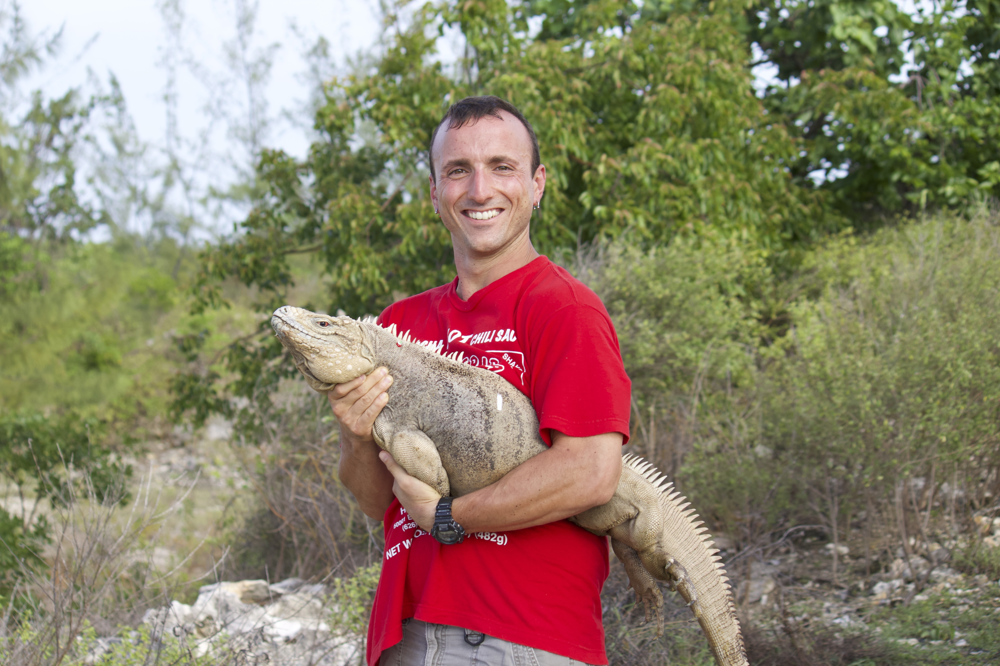{group="field" description="Credit: not quite sure..."}

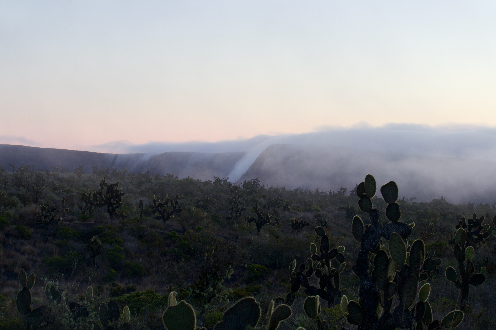{group="field" description="Credit: Giuliano Colosimo"}

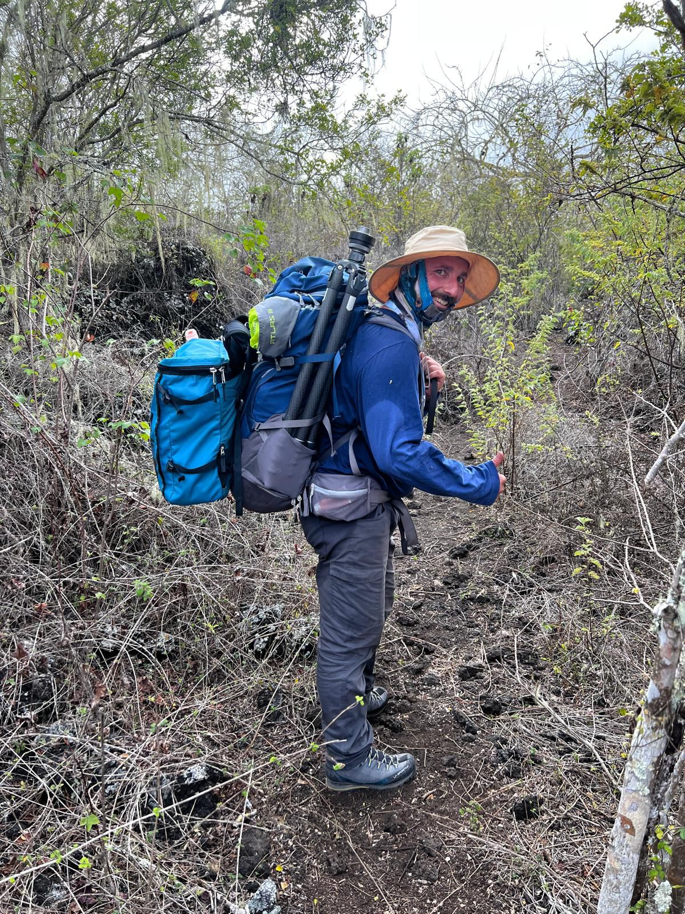{group="field" description="Credit: Jordyn Downes"}
:::

## Big, medium, and small lizards

::: {.photo-grid}
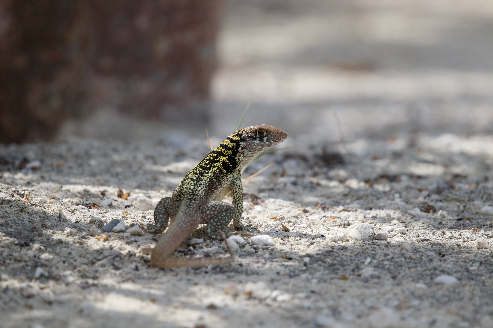{group="lizards" description="The lion lizard from the Turks and Caicos. Credit: Giuliano Colosimo"}

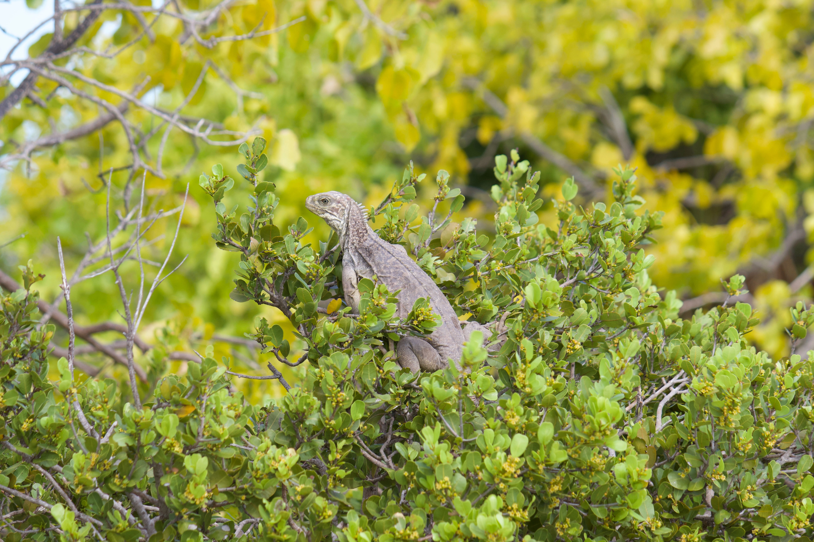{group="lizards" description="Turks and Caicos rock iguana. Credit: Giuliano Colosimo"}

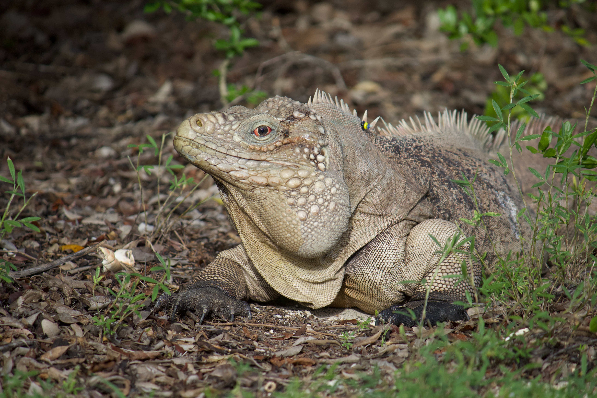{group="lizards" description="Credit: Giuliano Colosimo"}

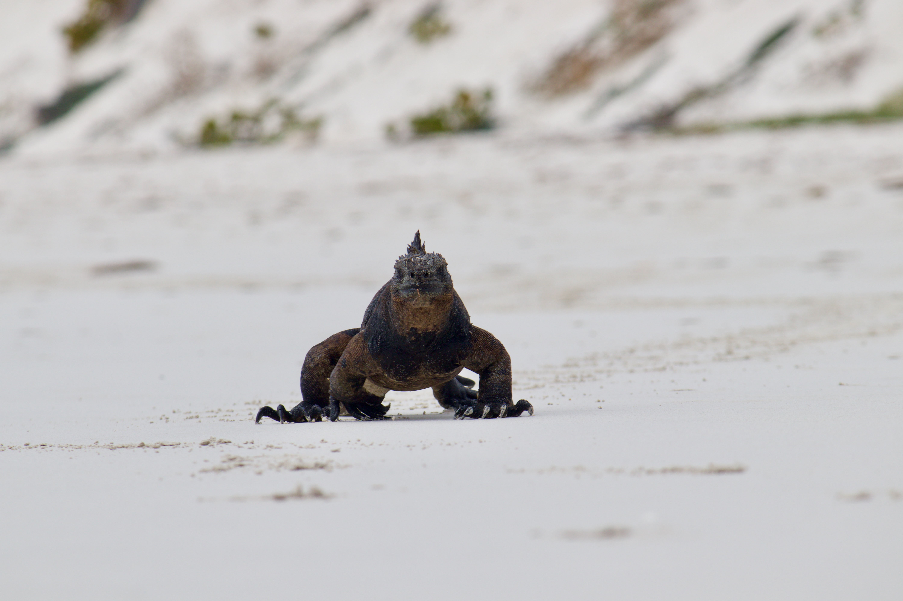{group="lizards" description="Marine iguana. Credit: Giuliano Colosimo"}

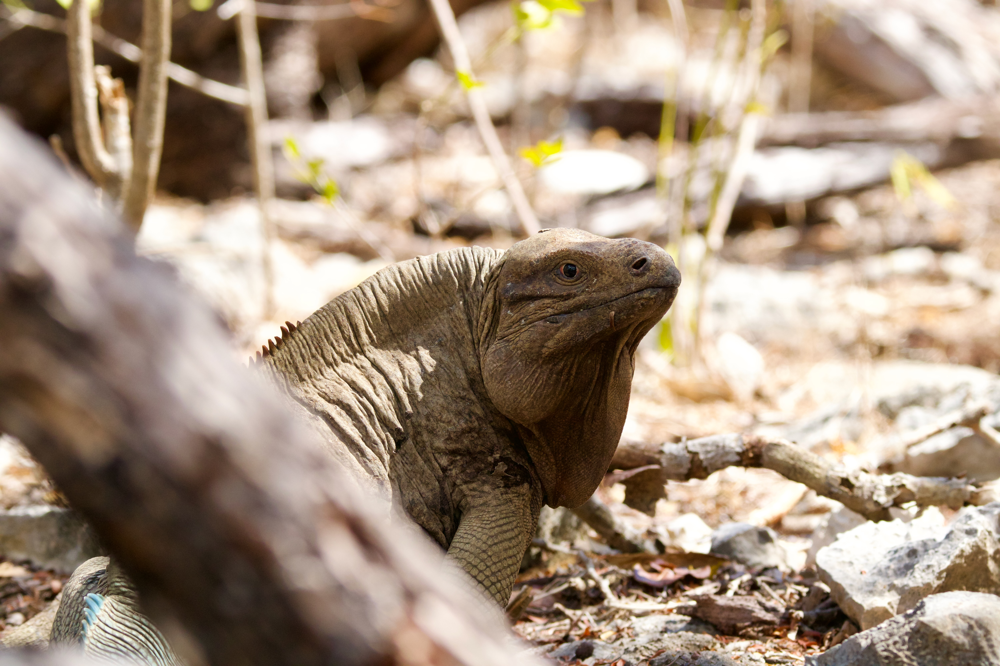{group="lizards" description="Anegada rock iguana. Credit: Giuliano Colosimo"}

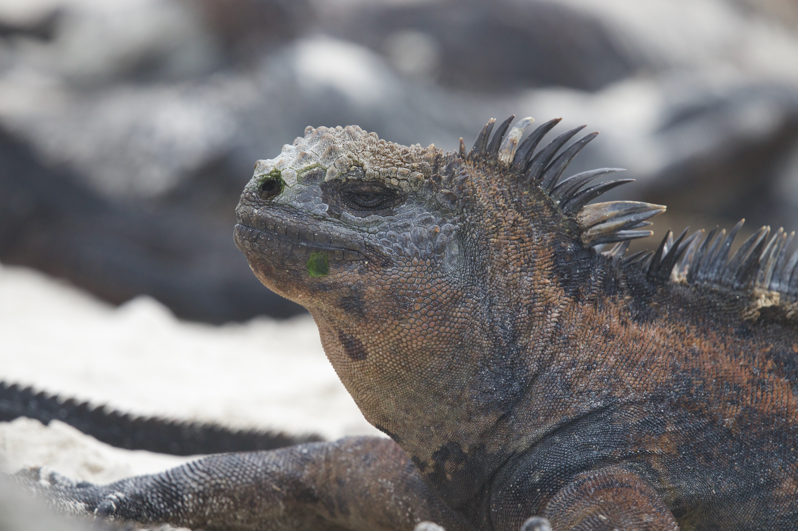{group="lizards" description="Credit: Giuliano Colosimo"}

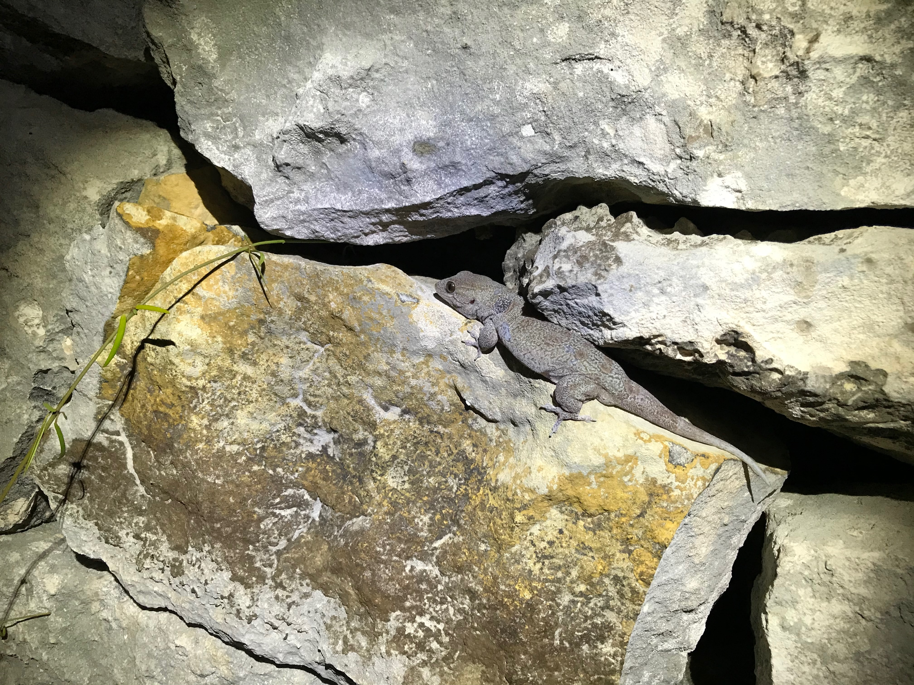{group="lizards" description="Credit: Giuliano Colosimo"}

{group="lizards" description="Credit: Giuliano Colosimo"}

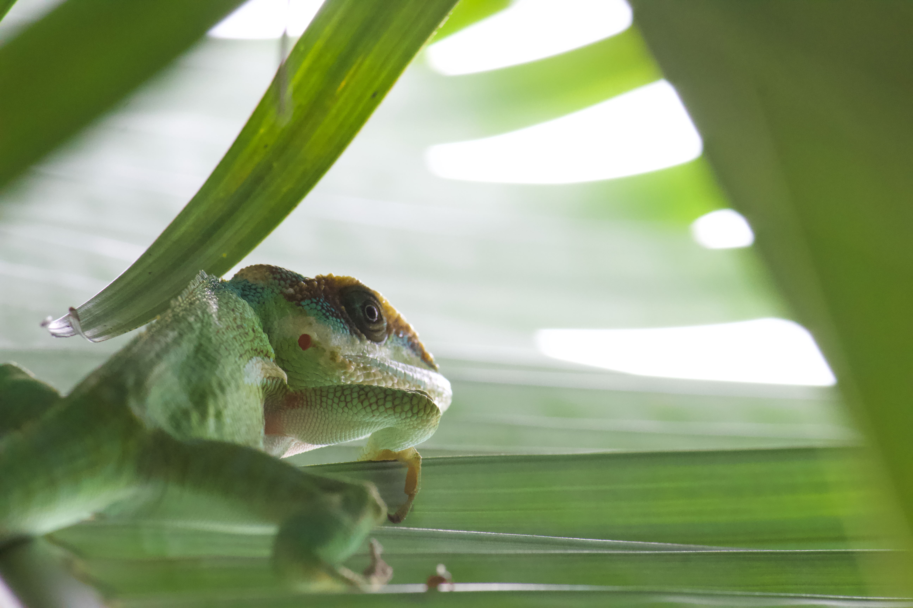{group="lizards" description="Credit: Giuliano Colosimo"}
:::

## Other animals

And since life is not just about lizards...

::: {.photo-grid}
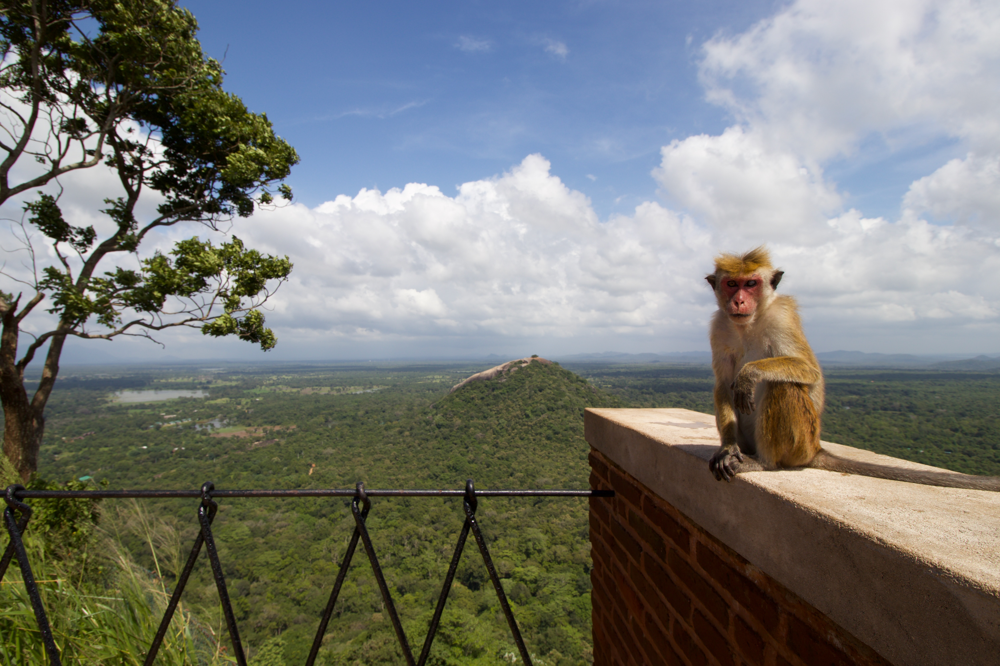{group="animals" description="Credit: Giuliano Colosimo"}

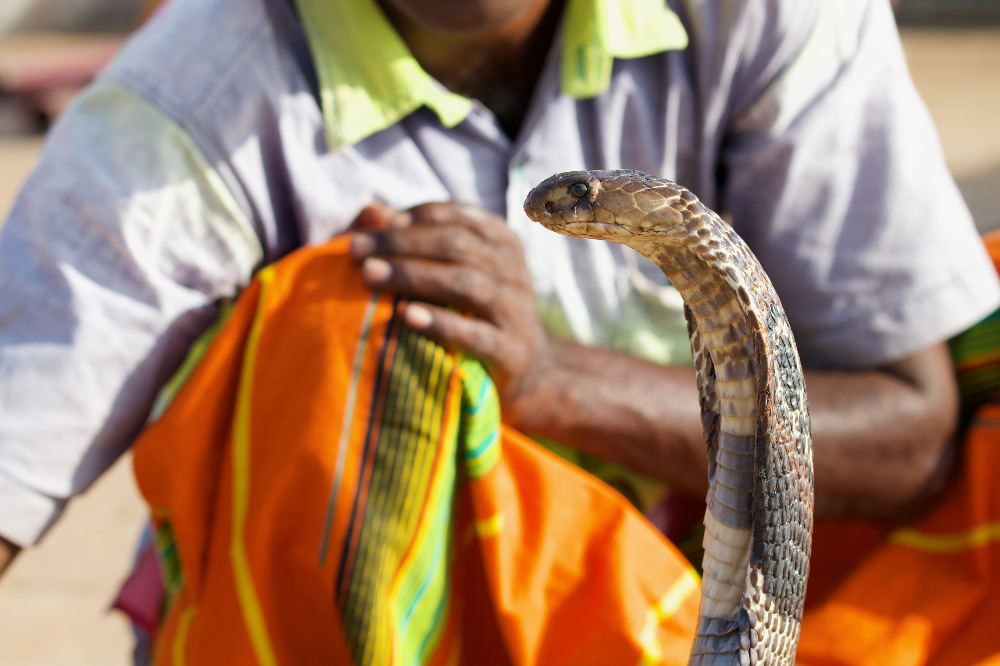{group="animals" description="King cobra. Credit: Giuliano Colosimo"}

{group="animals" description="Credit: Giuliano Colosimo"}

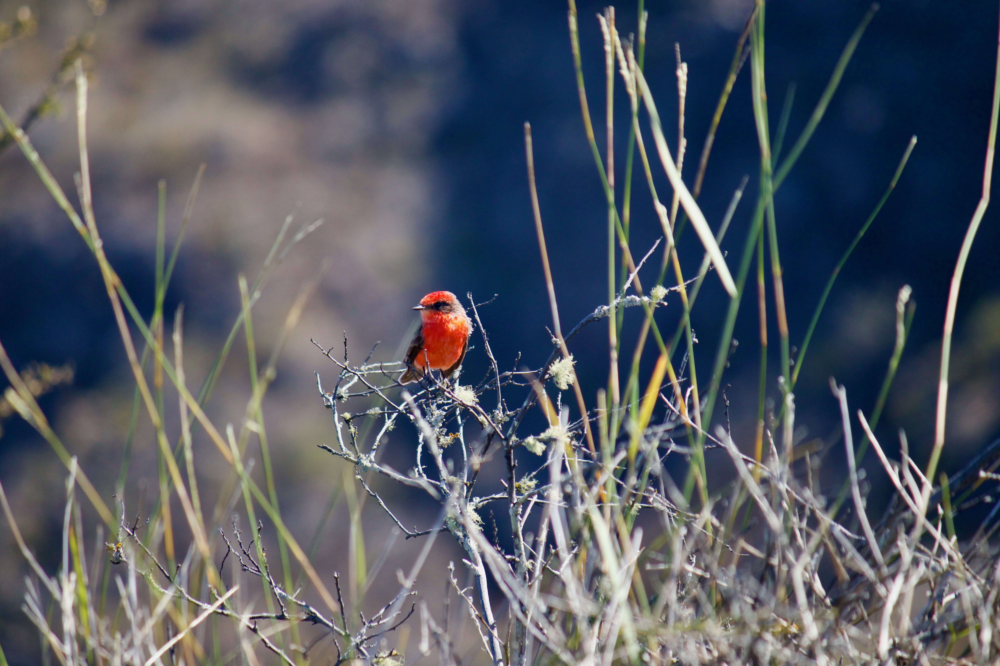{group="animals" description="Credit: Giuliano Colosimo"}

:::

## Places

Places I visited and found fascinating and pic-worthy.

::: {.photo-grid}
{group="places" description="Credit: Giuliano Colosimo"}

{group="places" description="Credit: Giuliano Colosimo"}
:::

## People

Traveling is not just about seeing places, but also about meeting people.

::: {.photo-grid}
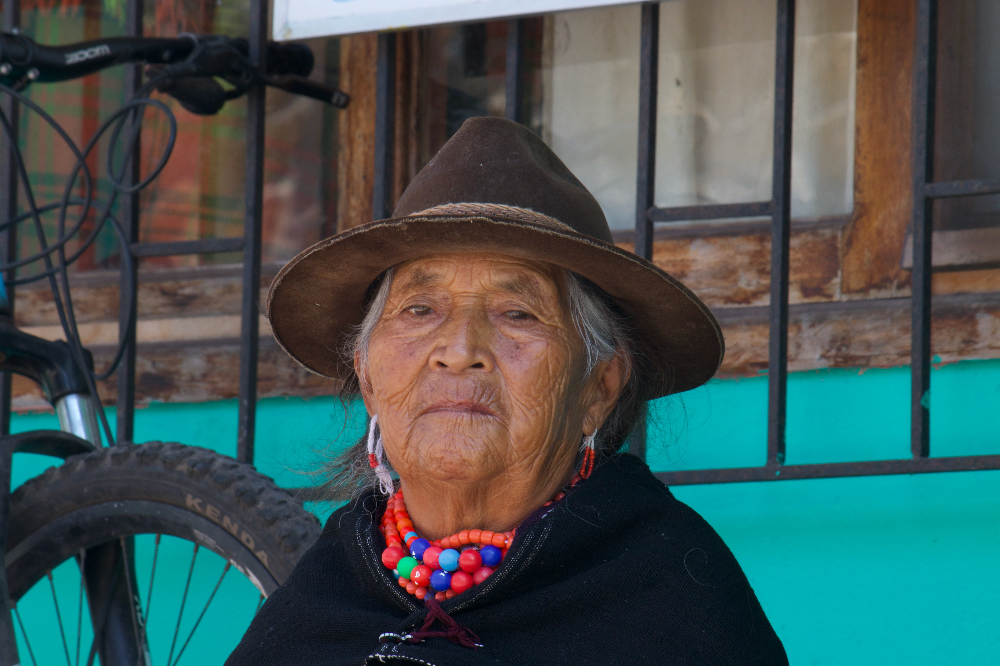{group="people" description="Credit: Giuliano Colosimo"}
:::
