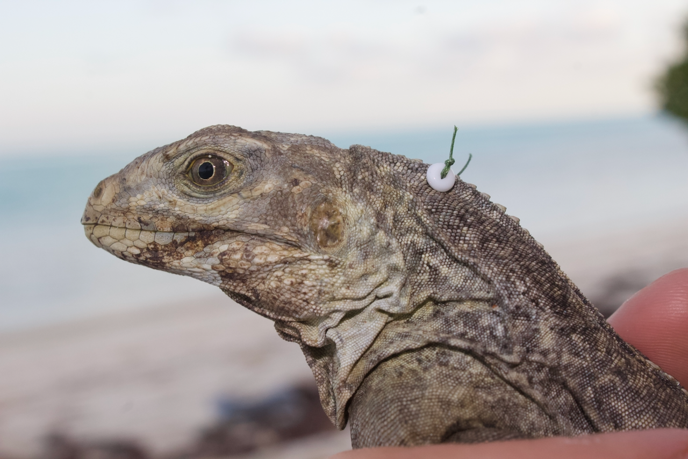

My research sits at the meeting point of **molecular ecology**, **movement
ecology**, and **conservation technology**. The through-line is island systems:
small, isolated populations are natural experiments in evolution, and they are
also the populations most likely to disappear while we are still describing
them.

Broadly, I work on three questions:

- **How do small, isolated populations persist?** Population genetic structure,
  gene flow, and inbreeding in fragmented island habitats.
- **What are animals actually doing out there?** Remote monitoring of species in
  places too hostile or too remote for sustained human presence.
- **How do we measure welfare in the wild?** Extracting physiological signals
  from low-cost sensors carried by free-ranging animals.

## Projects

::: {.project-grid}

<h3><a href="taco.qmd">T. A. Co.</a></h3>

Tracking Animals and Conservation

A miniaturised, low-cost system for remotely monitoring critically
endangered species. Built for the Galapagos pink land iguana
(<em>Conolophus marthae</em>), which lives only on the slopes of Wolf Volcano —
an area so remote that conventional monitoring is nearly impossible.

<a class="project-more" href="taco.qmd">Read more →</a>

<h3><a href="macra.qmd">M. A. C. R. A.</a></h3>

Cardiac rate from BCG and AI

Machine learning methods borrowed from particle physics at CERN, applied to
inertial measurement data, to recover cardiac and respiratory rates in wild and
domestic animals — non-invasively, in their own habitat.

<a class="project-more" href="macra.qmd">Read more →</a>

<!--

<h3><a href="gephast.qmd">GEPHAST</a></h3>

Genotype–phenotype association test

Tools for linking genetic variation to measurable traits in wild
populations, developed alongside my work on <em>Cyclura</em> population
genetics in the Caribbean.

<a class="project-more" href="gephast.qmd">Read more →</a>

<h3><a href="publications.qmd">Island conservation genetics</a></h3>

Ongoing · Caribbean &amp; Galapagos

Population structure, gene flow, and inbreeding in <em>Cyclura</em> and
<em>Conolophus</em> across highly fragmented island habitats — the thread that
runs from my PhD through to current work.

<a class="project-more" href="publications.qmd">See publications →</a>

-->

:::

## Field sites

Most of my fieldwork has taken place in the Turks and Caicos Islands, The
Bahamas, the British Virgin Islands, the Cayman Islands, and the Galapagos
Archipelago, with laboratory work split between Mississippi State University,
the San Diego Zoo Wildlife Alliance, and the University of Rome Tor Vergata.

Fieldwork is not incidental to this research — it is most of it. A decade of
organising and running sample-collection missions in remote places has shaped
what questions I think are worth asking, and which ones are actually
answerable.

## Collaboration

I am a member of the [IUCN-SSC Iguana Specialist
Group](https://www.iucn-isg.org/), and much of my work is collaborative by
necessity: island conservation crosses jurisdictions, disciplines, and
institutions. If you are working on something adjacent, please
[get in touch](contacts.qmd).
